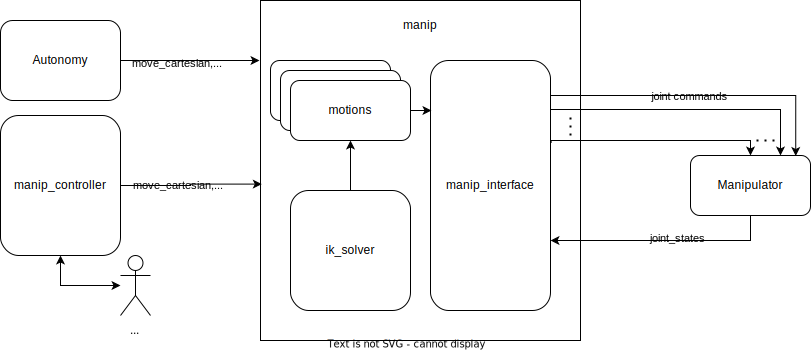

# manip_control

Software for controlling robot arms

## Usage

### Launch files

- `manip_control.launch`

```bash
roslaunch manip_control manip_control.launch
```

Launches the `manip_controller` node.

### Nodes

- `manip_controller`

    Controls the Sirius II manipulator. Offers three control modes:
  - **Incremental** - Move by a certain increment.
        The purpose of the Incremental mode is to allow for manual operation of the arm e.g. using a joystick.

  - **Cartesian** - Reach target pose in a straight line in cartesian space.
        Should be used during tasks, when the trajectory of the end effector should be predictable e.g. approaching a switch or carrying rock sample.

  - **Jointspace** - Reach target pose in a straight line in joint space.
        Should be used for moves spanning long distance, in such situations it's safer than Cartesian.

  The Incremental mode is active when no movement in the other modes is being executed. When a movement is requested, the Jointspace mode activates by default. You can toggle the mode of the requested movements to Cartesian by calling the `toggle_mode` service. You can use commandline:

    ```bash
    rosservice call /manip_controller/toggle_mode "{}"
    ```

    Subscribed Topics:
  - `/cmd_manip_pos` (geometry_msgs/PointStamped)

    Requested end effector position for the manipulator. Each message on this topic is a new movement request.

  - `/cmd_manip` (geometry_msgs/Twist)

    Requested velocity of the end effector.

    Services:
  - `~toggle_mode` (std_srvs/Empty)

    Toggle between Jointspace mode and Cartesian mode.

  Parameters:
  - `~queue_size`
    - Type: `integer`
    - Default: `16`

    How many queued movements shall the controller store. After the limit is reached moves enqueued earlier are dropped in favour of the new ones.

  - `~joystick_timeout`
    - Type: `float`
    - Default: `0.5`
    - Unit: `Seconds`

    Time, after which robot will stop if no new joystick commands are received.

  - `~jointstate_topic`
    - Type: `string`
    - Default: `/manipulator/joint_states`

    The topic from which current configuration of the manipulator will be read.

  - `~command_topics`
    - Type: `dict`
    - Default: `{}`

    The topics on which joint commands will be published. Given like: `joint_name: /topic_name`

  - `~control_modes`
    - Type: `dict`

    Parameters of individual control modes. Detailed explanation below.

  - `~links`
    - Type: `dict`

    Parameters specifying the kinematics of the robot. Used by inverse kinematics solver. Detailed explanation below.

   `control_modes` parameters:

    For Jointspace and Cartesian modes (`jointspace`, `cartesian`):

  - `~control_modes/mode/max_velocity`
    - Type: `float`

    The velocity which mustn't be exceeded during motions. *Note that we are combining position and orientation during motion interpolation, so the unit is neither m/s nor rad/s. The same reasoning applies to acceleration and error*.

  - `~control_modes/mode/acceleration`
    - Type: `float`

        The acceleration used while moving.

  - `~control_modes/mode/max_error`
    - Type: `float`

    Specifies the threshold at which the target is consider reached and the motion interpolation shall end.

  - `~control_modes/mode/interpolation_rate`
    - Type: `float`
    - Unit: `Hz`

    Rate of the motion interpolation. Directly affects the rate of commands sent to the joint controllers.

  - `~control_modes/mode/velocity_weighing`
    - Type: `list` of `float`

    How much given dimension contributes to the calculation of velocity vector norm. If the value is small, the movement in corresponding dimension won't limit the total velocity. Comes in handy when a joint should be allowed to move quickly e.g. the rotation of the end effector. The values correspond to [x, y, z, r, p, y] in Cartesian mode and [j0, j1, j2, j3, j4, j5] in Jointspace mode.

    For Incremental mode (`incremental`):

    - `~control_modes/incremental/send_rate`
      - Type: `float`

    The rate at which joint commands shall be sent to joint controllers.

    `links` parameters:

    - `~links/lengths`
      - Type: `list` of `float`
      - Unit: `Meters`

      Lengths of the links of the manipulator.

    - `~links/names`
      - Type: `list` of `str`

      Names of the joints of the manipulator.

    - `~links/limits`
      - Type: `list` of `list[2]` of `float`
      - Unit: `radians`

      Upper and lower limits of the joints of the manipulator.

## System structure


