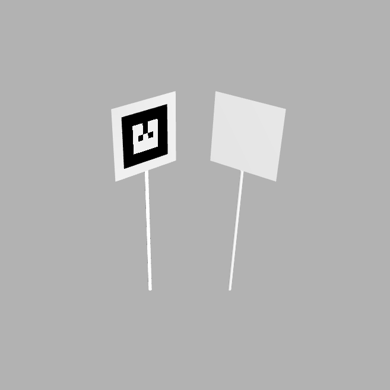
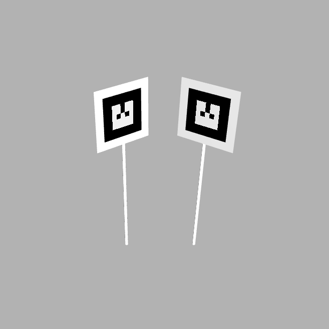
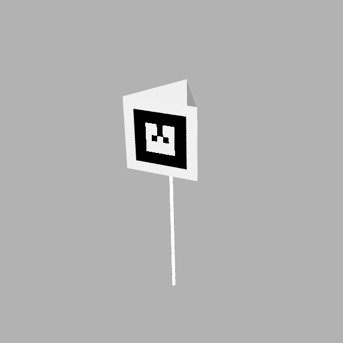

# marker_description package
Description of the fiducial markers. Package provides:
- Textures of the fiducial markers and gazebo materials for them
- Urdf (xacro) models of fiducials markers:
    |One sided marker|Two sided marker|Three sided marker|Four sided marker|
    |:---:|:---:|:---:|:---:|
    |||||
- Launch file for spawning fiducial markers in gazebo
## Usage

### Launch files
- `marker_spawner.launch`
  ```bash
  $ roslaunch marker_description marker_spawner.launch
  ```
  Spawns one fiducial marker in gazebo. 
  Optional arguments:
    - 'x' - x coordinate of the marker in meters (default: `0`)
    - 'y' - y coordinate of the marker in meters (default: `0`)
    - 'z' - z coordinate of the marker in meters (default: `0`)
    - 'R' - roll angle of the marker in radians (default: `0`)
    - 'P' - pitch angle of the marker in radians (default: `0`)
    - 'Y' - yaw angle of the marker in radians (default: `0`)
    Also accepts all arguments from `marker.urdf.xacro` (see below).

## URDF
- `marker.urdf.xacro`  
    Fiducial markers model.
    In order to generate urdf file run:
    ```bash
    $ roscd urdf/
    $ xacro marker.urdf.xacro -o marker.urdf sides:=<sides> family:=<family> id:=<id> name:=<name> marker_size:=<marker_size> margin:=<margin> pole_height:=<pole_height> pole_radius:=<pole_radius>
    ```
    Where:
    - `<sides>` - number of sides of the marker (1-4) (default: 1)
    - `<family>` - tag family (currently only `artag` is available) (default: `artag`)
    - `<id>` - id of the marker (default: `0`)
    - `<name>` - name of the marker - used for naming gazebo model, links and joints (default: `${family}_${id}`)
    - `<marker_size>` - size of the marker in meters (default: `0.15`)
    - `<margin>` - margin on each side of the marker in meters (default: `0.03`)
    Set to `0` to remove the margin.
    - `<pole_height>` - height of the pole in meters (default: `0.417`)  
    Set to `0` to remove the pole.
    - `<pole_radius>` - radius of the pole in meters (default: `0.005`)
## Textures
Textures are located in `media/materials/texture/` directory and are organized in subdirectories named after tag family. All gazebo material files are located in `media/materials/scripts/` directory and are named as `<family>_<id>`. Currently there are following tag families available:
- [`artag`](media/materials/texture/artag/)  
    id: 0-17  
    

## Other
- [PNG optimizer script](media/materials/texture/optimize_png.py)  
    Script for optimizing png files in `media/materials/texture/` directory. 
    Usage:
    ```bash
    $ cd media/materials/texture/
    $ python optimize_png.sh <input_path> [output_path] [-f]
    ```
    Where:
    - `<input_path>` - path to file or directory to optimize. If directory is specified, all png files in it will be optimized recursively.
    - `[output_path]` - path to output file or directory. If not specified, optimized files will be saved in the same directory as input files overwriting them.
    - `[-f]` - force overwriting of existing files.

    It is recommended to install pngcrush (`sudo apt install pngcrush`) before running the script for better results. This script also depends on PIL library (`pip install pillow`).

    The script was made specifically for optimizing images of fiducial markers. It uses PIL library to convert images to grayscale and change their bit depth to 1. If pngcrush is installed, it will be used to further optimize the images as it is able to apply better compression than PIL.

