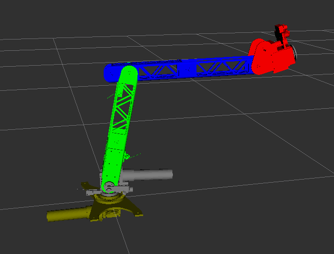

# sirius_description package
Description of the Sirius hardware. Package provides:
- Urdf (xacro) models of the rover
- Config files for the rover hardware
- Launch files for hardware and rviz

## Usage

### Launch files
- `manipulator.launch`
  ```bash
  $ roslaunch sirius_description manipulator.launch
  ```
  Preview manipulator model in rviz.
- `sirius.launch`
  ```bash
  $ roslaunch sirius_description sirius.launch
  ```
  Setup hardware of the sirius rover. Runs `driver.py` nodes from the `roboclaw_driver` package, `sirius_control_loop` node from the `sirius_control_loop` package and necessary ros_control nodes. Parameters should be changed in `controllers.yaml` and `hardware.yaml` file.
    `diff_drive_controller` topics:
    - `/cmd_vel`
    - `/odom`
    - `/joint_states`
    - `/tf`
    - `/sirius/controller/wheels/parameter_descriptions`
    - `/sirius/controller/wheels/parameter_updates`

    `roboclaw_driver` topics:
    - `/wheels_left/roboclaw/motor1/joint_state`
    - `/wheels_left/roboclaw/motor2/joint_state`
    - `/wheels_right/roboclaw/motor1/joint_state`
    - `/wheels_right/roboclaw/motor2/joint_state`
    - `/wheels_left/roboclaw/motor1/set_joint_state`
    - `/wheels_left/roboclaw/motor2/set_joint_state`
    - `/wheels_right/roboclaw/motor1/set_joint_state`
    - `/wheels_right/roboclaw/motor2/set_joint_state`

    Look into `diff_drive_controller` and `roboclaw_driver` packages for detailed description of each topic.
- `sirius_gazebo.launch`
  ```bash
  $ roslaunch sirius_description sirius_gazebo.launch
  ```
  Runs gazebo with `sirius_2.urdf.xacro` model and `marsyad.world` map from `leo_gazebo`  package. It also launches all neccessery ros control nodes. Parameters for `diff_drive_controller` should be changed in `controllers.yaml`.  
  Important topics:
  - `/cmd_vel`
  - `/odom`
  - `/left_side_camera/*` 
  - `/right_side_camera/*` 

  Look into `diff_drive_controller` packages for detailed description of each topic.

## URDF
- `manipulator.urdf.xacro`  
    Manipulator model  
    In order to generate urdf file run:
    ```bash
    $ roscd sirius_description/urdf/
    $ xacro manipulator.urdf.xacro -o manipulator.urdf
    ```
    
- `sirius_2.urdf.xacro`  
    Sirius 2 model  
    In order to generate urdf file run:
    ```bash
    $ roscd sirius_description/urdf/
    $ xacro sirius_2.urdf.xacro -o sirius_2.urdf
    ```
    

