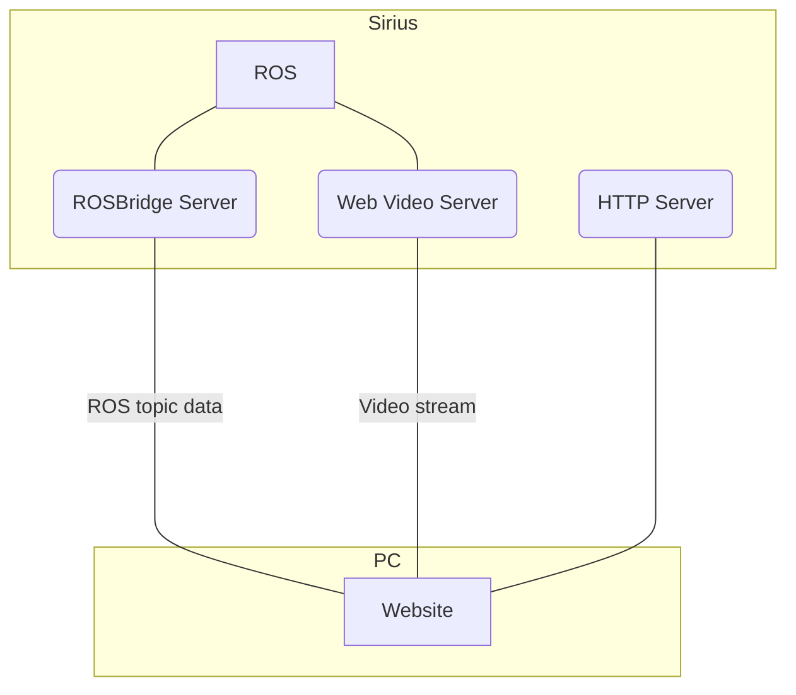

# web_interface
User interface for Sirius II rover. Package provides:
- Launch files for servers
- Source code for website

## Usage
### Build
- Building the code requires Node.js and npm. You can install those using:
  ```
  sudo apt install nodejs
  ```
  ```
  sudo apt install npm
  ```

- To build code:
  ```
  cd rover-soft/src/web_interface/website
  npm install
  npm run build
  ```
### Installing and configuring authbind
In order to host server on port `80`, `authbind` is required.
- Installation
  ```
  sudo apt install authbind
  ```
- Configuration
  ```
  sudo touch /etc/authbind/byport/80
  sudo touch /etc/authbind/byport/443
  sudo chmod 777 /etc/authbind/byport/80
  sudo chmod 777 /etc/authbind/byport/443
  ```
### Launch files
- When the website code is built, you can start all servers using `servers.launch`
  ```
  roslaunch web_interface servers.launch
  ```
- Alternatively, you may start only the ROSBridge and Web Video Server using `ros_servers.launch`
  ```
  roslaunch web_interface ros_servers.launch
  ```
  Used ports:
  - `80` - Website hosting server
  - `8081` - ROSBridge server
  - `8082` - Web Video Server

### ROS Params
Maximum velocities are read from `/web_interface/control/linear/x/max_velocity` and `/web_interface/control/angular/z/max_velocity`. These are remapped to `/sirius/controller/wheels/linear/x/max_velocity` and `/sirius/controller/wheels/angular/z/max_velocity` respectively in `ros_servers.launch`.

### Developing website
- In order for the changes to be immediately visible on the webpage it's better to start server using npm, as it will automatically recompile the source code when changes are made.
  ```
  cd rover-soft/src/web_interface/website
  npm run serve
  ```
- You will need to either start ROSBridge and Web Video Server manually:
  ```
  roslaunch rosbridge_server rosbridge_websocket.launch  port:=8081
    
  rosrun web_video_server web_video_server _port:=8082 _image_transport:=compressed
  ```
  or with `ros_servers.launch` launchfile
  ```
  roslaunch web_interface ros_servers.launch
  ```

### System structure


